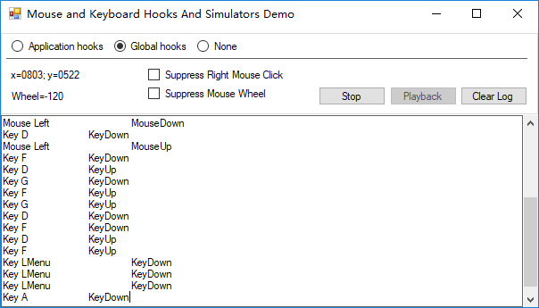

[![nuget][nuget-badge]][nuget-url]
[](https://github.com/loamen/KeyMouseHook/) 
[](https://travis-ci.org/loamen/KeyMouseHook)
[](https://raw.githubusercontent.com/loamen/KeyMouseHook/master/LICENSE)
[]()

[nuget-badge]: https://img.shields.io/badge/nuget-v1.0.0-blue.svg
[nuget-url]: https://www.nuget.org/packages/KeyMouseHook
[source-url]: https://github.com/loamen/KeyMouseHook


<a href="README.zh-CN.md" target="_blank">中文介绍</a> <br/>

## What it does?

This is a extension library use [globalmousekeyhook][MouseKeyHook-Url] and [InputSimulator][InputSimulator-Url] .it allows you to tap keyboard and mouse, to detect and record their activity event when an application is inactive and runs in background.The Windows Input Simulator provides a simple .NET(C#) interface to simulate Keyboard or Mouse input using the Win32 SendInput method.

## Prerequisites

* **Windows:** .Net Framework 4.6+

## Installation and sources

<pre>
  nuget install KeyMouseHook
</pre>

* [NuGet package][nuget-url]
* [Source code][source-url]

## Usage

```csharp
private readonly KeyMouseFactory eventHookFactory = new KeyMouseFactory(HookType.GlobalEvents);
private readonly KeyboardWatcher keyboardWatcher;
private readonly MouseWatcher mouseWatcher;
private List<MouseKeyEvent> _mouseKeyEvents;

public FormMain()
{
   InitializeComponent();

   keyboardWatcher = eventHookFactory.GetKeyboardWatcher();
   keyboardWatcher.OnKeyboardInput += (s, e) =>
   {
	if (_mouseKeyEvents != null)
	    _mouseKeyEvents.Add(e);
   };

   mouseWatcher = eventHookFactory.GetMouseWatcher();
   mouseWatcher.OnMouseInput += (s, e) =>
   {
	if (_mouseKeyEvents != null)
	    _mouseKeyEvents.Add(e);
   };
}

public void StartWatch(IKeyboardMouseEvents events = null)
{
    _macroEvents = new List<MacroEvent>();
    keyboardWatcher.Start(events);
    mouseWatcher.Start(events);
}

public void StopWatch()
{
   keyboardWatcher.Stop();
   mouseWatcher.Stop();
}

private void Playback()
{
   var sim = new InputSimulator();
   //var sim = new KeyMouseSimulator();
   sim.PlayBack(_macroEvents);
}
```

(also have a look at the Demo app included with the source)

## Screen Shots



## Thanks

* [globalmousekeyhook][MouseKeyHook-Url] (MIT License)
* [InputSimulator][InputSimulator-Url] (MIT License)

[MouseKeyHook-Url]: https://github.com/gmamaladze/globalmousekeyhook "MouseKeyHook"
[InputSimulator-Url]: https://github.com/michaelnoonan/inputsimulator "InputSimulator"

## License

The MIT license see: [LICENSE](LICENSE)
